<p align="center">
  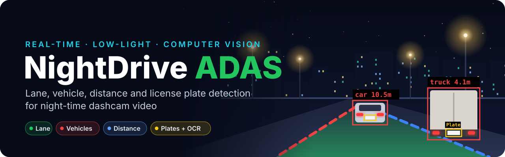
</p>

<p align="center">
  
  
  
  
  
  
</p>

<p align="center">
  <a href="#-demo">Demo</a> •
  <a href="#-how-it-works">How it works</a> •
  <a href="#-inside-each-subsystem">Deep dive</a> •
  <a href="#-the-debugging-journey">Debugging journey</a> •
  <a href="#-getting-started">Getting started</a> •
  <a href="#-limitations--future-work">Limitations</a>
</p>

---

**NightDrive ADAS** reads an ordinary dashcam video recorded **at night** and annotates every frame in real time:

| | Feature | What you see on screen |
|:-:|---|---|
| 🟩 | **Lane detection** | The current lane filled green, with dashed **red** (left) and **blue** (right) boundaries |
| 🟥 | **Vehicle detection & classification** | Boxes labelled `car` · `truck` · `bus` · `motorcycle` |
| 📏 | **Distance estimation** | Approximate distance in metres to the **3 nearest** vehicles |
| 🟨 | **License plate detection & OCR** | A yellow box on each plate, with the plate number shown when it can be read |

It works with a **normal RGB camera only**, with no infrared or thermal hardware. The whole low-light problem is solved in software.

> [!NOTE]
> Night footage breaks most "textbook" computer-vision assumptions. Headlights, streetlights and wet-road glare are all brighter than lane paint. Most of this project was spent **finding out exactly why each standard technique failed at night and fixing it**. All 19 of those problems are documented [below](#-the-debugging-journey).

## 🎬 Demo

<p align="center">
  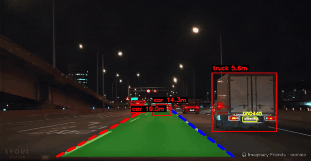
</p>

<p align="center"><sub>Full clip (≈38 s, 720p, no audio): <a href="demo/nightdrive_demo.mp4"><code>demo/nightdrive_demo.mp4</code></a></sub></p>

### At a glance

| **4** | **3** | **12** | **19** | **2** | **0 / 49** |
|:-:|:-:|:-:|:-:|:-:|:-:|
| subsystems in one loop | independent processing cadences | processing stages in the lane pipeline | real bugs found & fixed | "smarter" alternatives tested and rejected | lane-line crossings after the crossing guard |

---

## 🧭 How it works

<p align="center">
  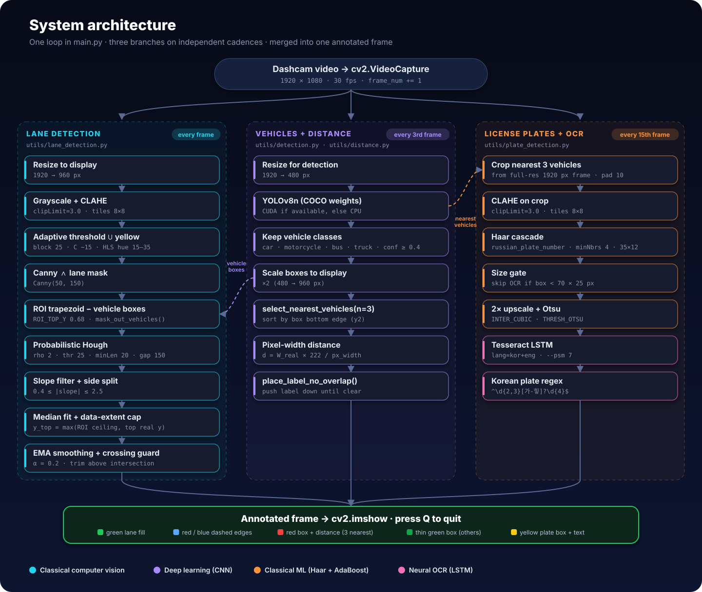
</p>

NightDrive is a **hybrid system**. Each sub-problem uses the technique that suits it best:

| Subsystem | Technique family | Method | Why this choice |
|---|---|---|---|
| Lane detection | **Classical CV** (no learning) | CLAHE · adaptive threshold · Canny · Hough | Lanes are mostly straight lines converging to a vanishing point, which suits edge and line detection. No training data needed. |
| Vehicle detection | **Deep learning** (CNN) | YOLOv8n, pretrained on COCO | Vehicles vary hugely in shape and angle, and a pretrained CNN generalises far better than hand-written rules. COCO already contains every class needed. |
| Plate localisation | **Classical ML** (Haar features + AdaBoost) | OpenCV `haarcascade_russian_plate_number.xml` | Ships free with OpenCV and is fast. It looks for plate-shaped rectangles in general, not Russian text, so it works on Korean plates too. |
| Plate reading | **Neural OCR** (LSTM) with classical preprocessing | Upscale + Otsu, then Tesseract 4+ (`kor+eng`) | Tesseract's LSTM reads character sequences. Preprocessing prepares the crop. |

### Performance design: three resolutions, three cadences

| Branch | Runs | Works on | Why |
|---|---|---|---|
| Lane detection | **every frame** | 960 px display frame | Cheap classical ops, and smooth lines need per-frame updates |
| YOLOv8n vehicles | **every 3rd frame** | 480 px detection frame | CNN inference is expensive. Cars barely move in 2–3 frames at 30 fps, so the last boxes are reused in between |
| Plates + OCR | **every 15th frame** | original **1920 px** frame | OCR is the slowest step. Full resolution gives it every available pixel of detail |

---

## 🔬 Inside each subsystem

### 1 · Lane detection: `utils/lane_detection.py`

<p align="center">
  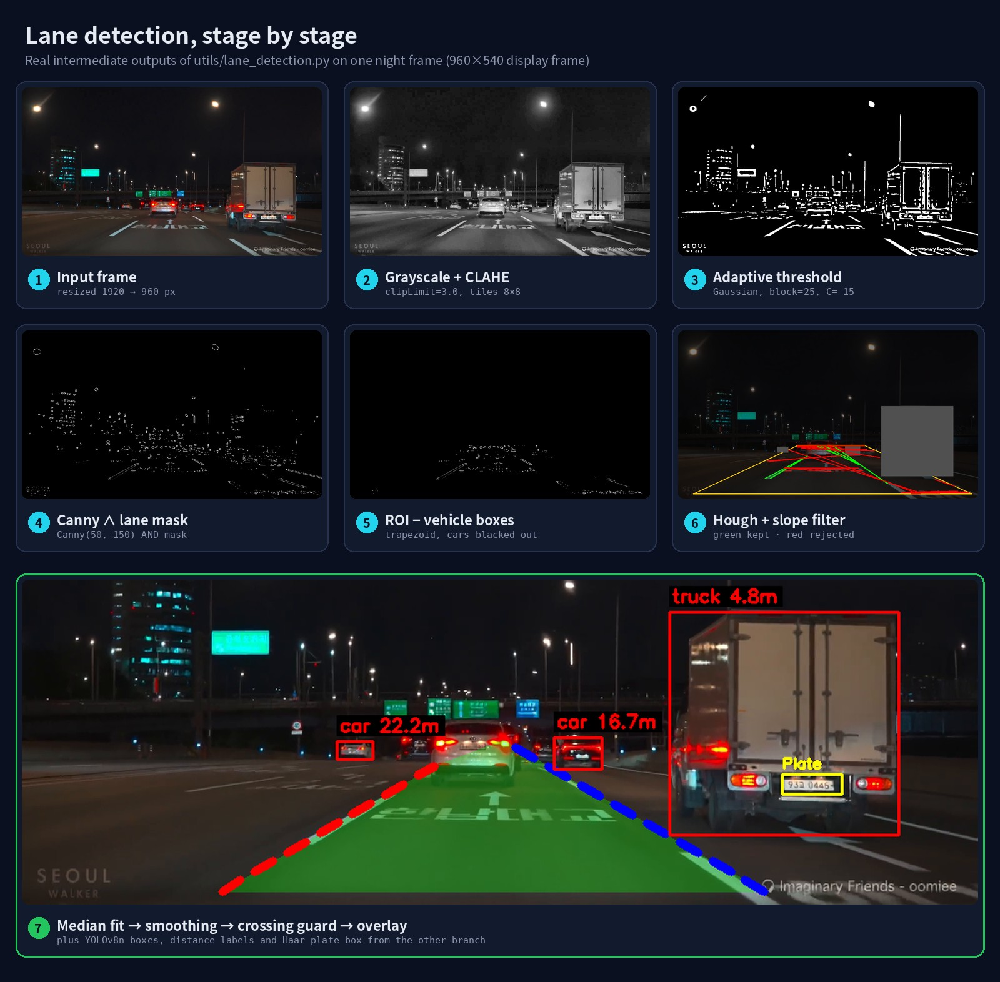
</p>

<sub>All panels above are real intermediate outputs from this repository's code, running on the test footage.</sub>

**The key night-time fix: local instead of global brightness.**
The classic daylight recipe marks any pixel brighter than a fixed value (e.g. `L > 195`) as lane paint. At night that captures streetlights and headlights and misses the dim paint. On the same frame with identical downstream settings, **the fixed threshold produced 0 Hough lines inside the ROI, while the adaptive pipeline produced 27 segments**:

<p align="center">
  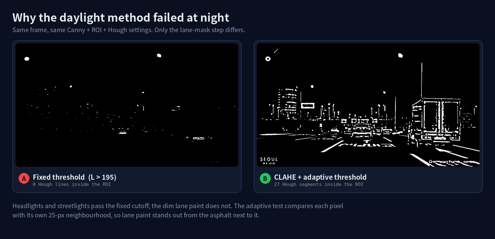
</p>

- **CLAHE** (`clipLimit=3.0`, 8×8 tiles) equalises contrast *per tile*, so faint paint separates from the asphalt around it. `clipLimit` stops noise from being amplified in flat, dark tiles.
- **Adaptive Gaussian threshold** (`blockSize=25`, `C=-15`) compares each pixel with its *own neighbourhood*. Lane paint is always brighter than the asphalt next to it, whether it's day or night.
- A **yellow HLS mask** (hue 15–35, saturation ≥ 100) is OR-ed in for yellow centre lines.

**Geometry safeguards, each added after a real failure:**

| Safeguard | How it works |
|---|---|
| Single source of truth for the ROI | Six `ROI_*` constants define the trapezoid **and** limit how far lines are drawn (`ROI_TOP_Y = 0.68`) |
| Vehicle masking | `mask_out_vehicles()` blacks out YOLO boxes in the edge map **before** Hough, so car bodies can never become lane evidence |
| Slope plausibility | Segments are kept only if `0.4 ≤ \|slope\| ≤ 2.5`, which rejects flat shadows and near-vertical poles (slopes of −18 to −28 were measured) |
| Side assignment | Negative slope left of centre → left line, positive slope right of centre → right line. The centre follows the previous frame's lane |
| Robust fit | `np.median` over each segment's (slope, intercept) pair, so one side's fit can't be dragged by an outlier |
| Data-extent cap | `y_top = max(ROI ceiling, topmost real pixel)` means a line is never drawn beyond its evidence |
| Side clamp | Each line's x position is kept at least 5 px on its own side of the lane centre |
| Temporal smoothing | EMA with `α = 0.2`. A jump of more than 150 px is treated as a glitch and ignored |
| Crossing guard | Solves for the exact y where the two lines intersect, and trims both lines just below it if that point is visible. **0 crossings across 49 test frames** |

The crossing guard solves this equation:

```text
x_left(y)  = lx1 + sL·(y − ly1)          sL = (lx2 − lx1)/(ly2 − ly1)
x_right(y) = rx1 + sR·(y − ry1)          sR = (rx2 − rx1)/(ry2 − ry1)
x_left(y) = x_right(y)  ⇒  y_cross = (rx1 − lx1 + sL·ly1 − sR·ry1) / (sL − sR)
```

<p align="center">
  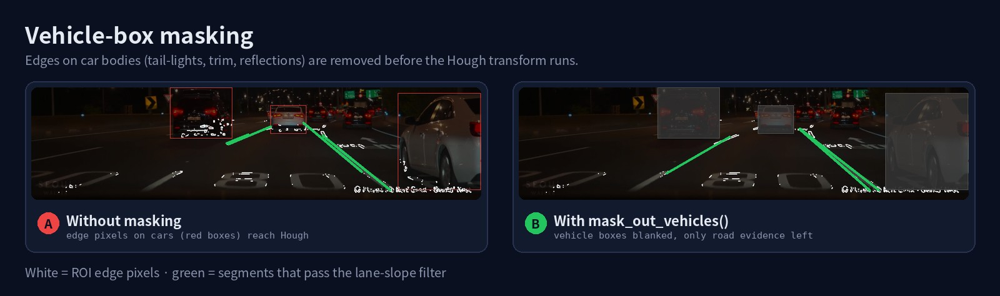
</p>

<details>
<summary><b>🧪 Two "smarter" fitting methods I tested and rejected</b></summary>
<br>

| Alternative | Result on real footage | Decision |
|---|---|---|
| **Quadratic lane fit** `x = ay² + by + c` to follow bends | Most frames give only 1–3 segments per side (2–6 points), which is far too few for 3 parameters. The curve swung wildly from frame to frame. | Reverted |
| **Huber-loss `cv2.fitLine`** (outlier-robust) | Frame-to-frame slope std dev was ≈ 0.067, *the same* as the plain median. With 2–6 points there are no outliers to be robust against. | Reverted |

Keeping the simpler model was a deliberate choice of **stability over sophistication**. Curved fitting is worth revisiting only once the pipeline produces more line evidence per frame.
</details>

<details>
<summary><b>🎛️ Re-tuning for a different camera: <code>lane_tuner.py</code></b></summary>
<br>

The six ROI values match one camera mount. `lane_tuner.py` opens the video with live sliders for the ROI corners, CLAHE clip, threshold block size and offset, Canny limits and Hough parameters. It shows the mask, the edges and exactly what Hough sees. When you quit, it prints values ready to paste into `utils/lane_detection.py`.
</details>

### 2 · Vehicles & distance: `utils/detection.py` · `utils/distance.py`

- **YOLOv8n** (the nano model, chosen for speed) runs on a 480 px frame. It uses the GPU when CUDA is available and the CPU otherwise.
- Only COCO classes `2 car · 3 motorcycle · 5 bus · 7 truck` with confidence **≥ 0.4** are kept.
- **Nearest-3 selection:** vehicles are sorted by the bottom edge of their box. In a forward-facing camera, lower in the frame means closer. The 3 nearest get a red box and a distance label. The rest get a thin green box, so the screen stays readable in dense traffic.
- **Overlap-free labels:** `place_label_no_overlap()` checks each new label against those already placed and moves it down until it's clear.

**Distance** uses the pinhole-camera relationship:

```text
distance = real_width × focal_length / pixel_width
real_width: car 1.8 m · truck/bus 2.5 m · motorcycle 0.8 m        focal_length = 222
```

The focal length was **calibrated empirically** from a vehicle in the footage judged to be about 10 m away: `f = 10 × 40 / 1.8 ≈ 222`. The readings are therefore estimates, not measurements. Values outside **1.5–200 m** are discarded.

### 3 · License plates & OCR: `utils/plate_detection.py`

1. **Crop from the original frame.** The 3 nearest boxes are mapped back to **1920 px** coordinates (+10 px padding). An earlier version cropped from the resized display frame, which had already lost detail in two resize steps.
2. **CLAHE + Haar cascade** (`scaleFactor 1.05`, `minNeighbors 4`, `minSize 35×12`).
3. **Size gate.** Boxes smaller than **70 × 25 px** are drawn but not sent to OCR, because they can't be read and would only cost time.
4. **Preprocess.** 2× cubic upscale, then Otsu binarisation.
5. **Tesseract** with `lang="kor+eng"` and `--psm 7` (single text line).
6. **Strict validation.** The result is kept only if it matches the Korean plate format:

```python
_PLATE_PATTERN = re.compile(r"^\d{2,3}[\uAC00-\uD7A3]?\d{4}$")   # e.g. 12가3456 / 123가4567
```

A valid read is drawn above the yellow box. Otherwise the label is just `Plate`. **Nothing is written to disk.**

> [!TIP]
> **The biggest "aha" moment of the project.** For a long time OCR did not read a *single* plate correctly, and no amount of blur, contrast or upscaling tuning helped. The reason: Korean plates contain a **Hangul character** in the middle (`12가3456`), and Tesseract had been restricted to an English-only whitelist `A–Z 0–9`, so it could never produce a correct result. The fix was configuration, not image quality: install Korean language data, use `kor+eng`, remove the whitelist, and validate against the real plate format.

---

## 🐞 The debugging journey

<p align="center">
  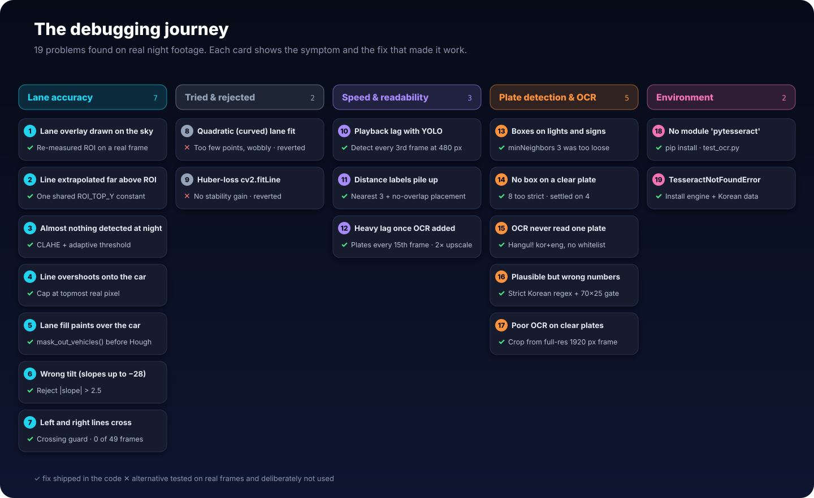
</p>

<details open>
<summary><b>Full log: symptom → root cause → fix</b></summary>
<br>

| # | Symptom | Root cause | Fix | Where |
|:-:|---|---|---|---|
| 1 | Lane overlay appears in the sky and on buildings | ROI trapezoid was set for a different video's framing | Re-measured the ROI on a real frame from the test video | `ROI_*` constants |
| 2 | Lane line drawn far above the road | Line top height was a separate hard-coded value (`0.35`), unrelated to the ROI top (`0.68`) | One shared `ROI_TOP_Y` for both the mask and the drawing limit | `make_line()` |
| 3 | Almost no lane pixels found at night | Fixed global threshold (`L > 195`) assumes daylight | CLAHE + adaptive Gaussian threshold | `filter_lane_colors()` |
| 4 | Line still overshoots and runs onto the car ahead | Always extrapolated to the ROI top, even with no evidence there | `y_top = max(roi_ceiling, min(ys_seen))` | `make_line()` |
| 5 | Green fill painted over the car ahead | Tail-lights, trim and reflections on the car passed the mask as "lane" edges | Black out vehicle boxes before Hough | `mask_out_vehicles()` |
| 6 | Lane angle visibly wrong | Near-vertical poles and building edges (slopes −18 to −28), with no upper slope limit | Also reject `\|slope\| > 2.5` | `average_slope_intercept()` |
| 7 | Red and blue lines cross each other | Nothing stopped two separately fitted lines from intersecting within the drawn range | Solve for `y_cross` and trim both lines. **0 / 49 frames** crossed after the fix | `prevent_crossing()` |
| 8 | *Tried:* curved lane fit | 1–3 segments per side is too little data for a quadratic | Reverted to a straight line (stability over sophistication) | — |
| 9 | *Tried:* Huber-loss `fitLine` | No measurable stability gain (slope std ≈ 0.067 for both) | Reverted to the median fit | — |
| 10 | Playback became choppy after adding YOLO | CNN inference on every frame | Run YOLO every 3rd frame on a 480 px frame and reuse the boxes | `DETECT_EVERY_N_FRAMES` |
| 11 | Distance labels stacked into unreadable clutter | Every vehicle was labelled, with no collision check | Label only the nearest 3, and shift labels down on overlap | `select_nearest_vehicles()`, `place_label_no_overlap()` |
| 12 | Yellow plate boxes on traffic lights and signs | Cascade `minNeighbors` loosened to 3 | Made stricter again, with the OCR format check as a second filter | `PlateDetector` |
| 13 | No plate box at all on a clearly visible plate | `minNeighbors` over-corrected to 8 | Settled on **4** with `minSize=(35, 12)` | `PlateDetector` |
| 14 | **OCR never read a real plate** | English-only whitelist can't produce the Hangul character | `lang="kor+eng"`, no whitelist, Hangul-aware regex | `_read_text()` |
| 15 | `ModuleNotFoundError: pytesseract` | Wrapper not installed in the venv | `pip install pytesseract`, checked with `test_ocr.py` | environment |
| 16 | `TesseractNotFoundError` | The OCR **engine** is a separate program, and Korean data isn't installed by default | Installed Tesseract (UB-Mannheim) with **Korean** selected | environment |
| 17 | Plausible-looking but wrong plate numbers | Loosened "any 3+ digits" rule accepted garbage, and tiny crops were being read | Strict Korean-format regex, and OCR only on boxes ≥ 70×25 px | `_PLATE_PATTERN`, `MIN_OCR_CROP_*` |
| 18 | Heavy lag once OCR was added | Tesseract is the slowest step in the pipeline | Plates every 15th frame, size gate, upscale reduced from 4× to 2× | `PLATE_DETECT_EVERY_N_FRAMES` |
| 19 | Poor OCR even on clear plates | Crops came from the resized display frame | Crop from the original 1920 px frame. Only the drawing uses display coordinates | `main.py` |

</details>

**What I took away from it:** start from the standard pattern, find the root cause of *each* failure on real footage, fix that exact cause, and **measure** before shipping anything "smarter".

---

## 🖼️ Screenshots

| Three nearest vehicles with distances | Plates localised in dense traffic |
|:-:|:-:|
| 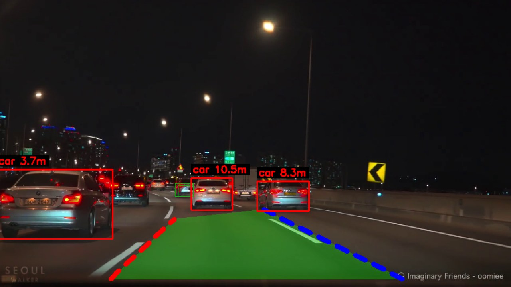 | 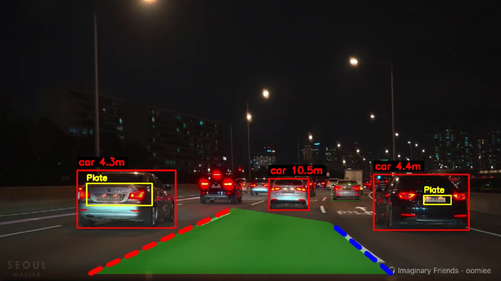 |
| **Truck and plate at close range** | **Plate found, plus a false positive on the cargo box** |
| 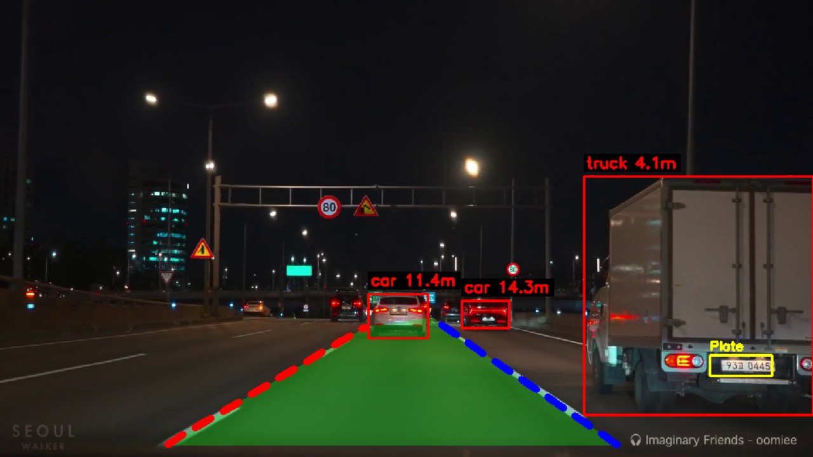 | 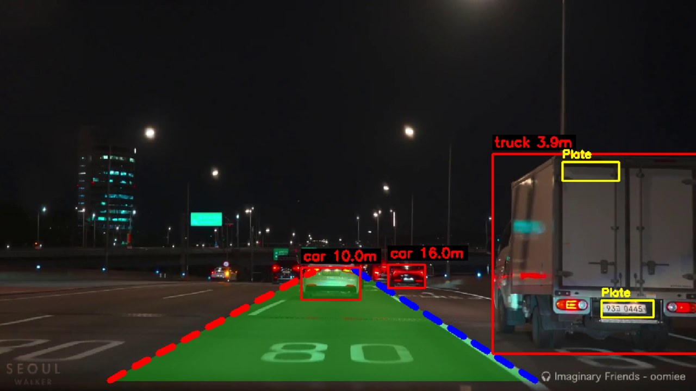 |

---

## 🚀 Getting started

### Requirements
- Windows, Python **3.11**
- Optional: an NVIDIA GPU (the code falls back to the CPU automatically)
- **Tesseract OCR engine** with **Korean** language data

### 1 · Clone and install

```bash
git clone https://github.com/<your-username>/nightdrive-adas.git
cd nightdrive-adas
python -m venv venv311
venv311\Scripts\activate
pip install -r requirements.txt
```

For GPU acceleration, install the CUDA build of PyTorch first (see the comment in `requirements.txt`).
`yolov8n.pt` is not included in the repo. Ultralytics downloads it automatically on the first run.

### 2 · Install the Tesseract engine

`pytesseract` is only a Python wrapper, so the engine itself has to be installed separately:

1. Download the installer from [UB-Mannheim/tesseract](https://github.com/UB-Mannheim/tesseract/wiki).
2. On **"Select Additional Language Data"**, tick **Korean**. It is *not* selected by default.
3. Keep the default path `C:\Program Files\Tesseract-OCR\`, or update `tesseract_cmd` in `utils/plate_detection.py`.

### 3 · Check your setup

```bash
python check_setup.py        # OpenCV + Ultralytics versions
tesseract --list-langs       # should list: eng, kor, osd
python test_ocr.py           # 4-step OCR diagnostic
```

### 4 · Run

Place a night-time dashcam video in the project folder and set `VIDEO_PATH` at the top of `main.py` (and `lane_tuner.py`):

```bash
python main.py               # press Q to quit
python lane_tuner.py         # optional: re-tune the lane ROI (Space = pause, Q = quit)
```

> [!IMPORTANT]
> The lane ROI is tuned to one specific camera mount. With a different camera or video, run `lane_tuner.py` first and copy the printed values into `utils/lane_detection.py`.

<details>
<summary><b>🩺 Troubleshooting</b></summary>
<br>

| Problem | Fix |
|---|---|
| `WARNING: pytesseract not installed.` | `pip install pytesseract`. Boxes are still drawn, but OCR is skipped |
| `TesseractNotFoundError` | Install the engine (step 2) or correct `tesseract_cmd` |
| Plates never show a number | Run `tesseract --list-langs`. If `kor` is missing, reinstall with Korean ticked |
| `Error: Could not open video file.` | Check `VIDEO_PATH` and that the file is in the folder you run from |
| Lane overlay in the wrong place | Re-tune with `lane_tuner.py` |
| Choppy playback | Increase `DETECT_EVERY_N_FRAMES` / `PLATE_DETECT_EVERY_N_FRAMES`, or use a CUDA GPU |

</details>

---

## 📁 Project structure

```text
nightdrive-adas/
├── main.py                  # Video loop: runs all branches on their cadences, draws, displays
├── lane_tuner.py            # Live slider tool to re-tune ROI / CLAHE / threshold / Canny / Hough
├── test_ocr.py              # OCR diagnostic: wrapper → engine → languages → test read
├── check_setup.py           # Prints OpenCV and Ultralytics versions
├── requirements.txt
├── utils/
│   ├── lane_detection.py    # CLAHE, adaptive mask, ROI, vehicle masking, Hough, fitting, guards, drawing
│   ├── detection.py         # YOLOv8n wrapper + select_nearest_vehicles()
│   ├── distance.py          # Pixel-width distance estimate
│   └── plate_detection.py   # Haar cascade + Tesseract (kor+eng) + Korean plate regex
├── demo/
│   └── nightdrive_demo.mp4
└── docs/
    ├── demo.gif
    ├── assets/              # Banner, diagrams and pipeline figures used in this README
    └── screenshots/
```

---

## 🚧 Limitations & future work

**Current limitations**

- **Plate OCR rarely succeeds** on small, distant or motion-blurred night crops. The plate *region* is found far more reliably than the text inside it.
- The **Haar cascade** sometimes boxes other bright rectangles (signs, truck panels, on-screen text).
- The **straight-line** lane model does not follow bends.
- **Distances are approximate**, calibrated from one reference vehicle rather than from real camera parameters.
- **Detection and visualisation only.** No steering, braking or alerts.
- Identifies vehicle **type**, not make or model.

**Future work**

- [ ] Replace the Haar cascade with a YOLO model fine-tuned for license plates
- [ ] Save plate snapshots (vehicle type, colour, timestamp) to a backend with automatic 7-day retention
- [ ] Add a vehicle make/model classifier
- [ ] Add curved-lane tracking once there is enough line evidence per frame
- [ ] Two-stage safety alerts: **first** warn the driver when the gap to the vehicle ahead closes too fast, and **only after an actual collision** automatically notify a response service for emergency dispatch

---

## 🧰 Tech stack

<p>
  
  
  
  
  
  
</p>

## 🙏 Acknowledgements

- **Test footage:** night-time Seoul driving video from the **SEOUL WALKER** YouTube channel (its watermark is visible in the frames). It was used only for non-commercial testing and demonstration, and all rights belong to the original creator.
- [Ultralytics YOLOv8](https://github.com/ultralytics/ultralytics), with weights pretrained on the [COCO](https://cocodataset.org/) dataset
- [OpenCV](https://opencv.org/) and its bundled Haar cascades
- [Tesseract OCR](https://github.com/tesseract-ocr/tesseract) and the [UB-Mannheim](https://github.com/UB-Mannheim/tesseract/wiki) Windows builds

## 👤 Author

**Yaneth De Alwis**, Electronics & Communication Engineering undergraduate, University of Sri Jayewardenepura, Sri Lanka

<p align="center"><sub>If this project helped you, consider leaving a ⭐</sub></p>
